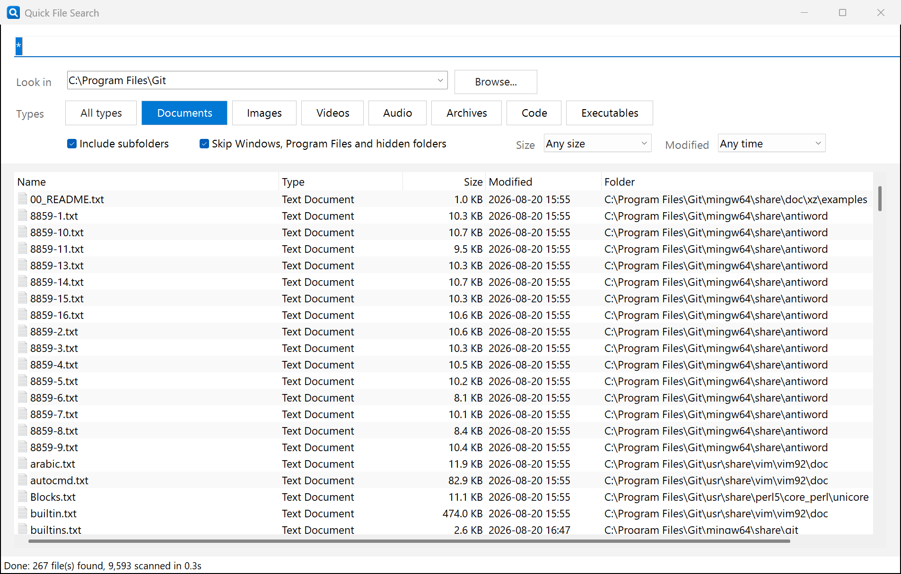

# Quick File Search

A small Windows desktop tool to search for files anywhere on the computer, filtered by basic file types.
Built with PowerShell + WinForms, so it needs nothing installed beyond Windows itself.

**Website:** https://lakshithalk.github.io/QuickFileSearch/



## Download

Grab `QuickFileSearch.exe` from the [latest release](https://github.com/lakshithalk/QuickFileSearch/releases/latest) and run it. No installation required.

The exe is not code-signed, so Windows SmartScreen may show "Windows protected your PC" the first time. Click **More info**, then **Run anyway**.

## Run from source

Double-click `QuickFileSearch.cmd`.

Or from a PowerShell prompt:

```powershell
powershell -ExecutionPolicy Bypass -STA -File .\QuickFileSearch.ps1
```

## Build the exe yourself

```powershell
powershell -ExecutionPolicy Bypass -File .\build.ps1
```

This installs the `ps2exe` module for the current user if needed and writes `dist\QuickFileSearch.exe`. Pushing a tag such as `v1.0.1` to GitHub runs the same build in GitHub Actions and attaches the exe to a release.

## Use

1. **Search box**: part of the file name (`report`), or a wildcard pattern (`*.pdf`, `inv??ce*`). Leave it empty to list every file of the chosen types.
2. **Look in**: pick `All drives`, a single drive, a common folder, or click `Browse...` for any folder. You can also type a path.
3. **Types**: leave `All types` on, or toggle any mix of Documents, Images, Videos, Audio, Archives, Code, Executables.
4. **Size / Modified**: optional filters such as "Over 10 MB" or "Last 7 days".
5. Press **Search** (or Enter / F5). Results stream in while the scan runs. Press **Stop** or Esc at any time.
6. Double-click a result (or press Enter) to open it. Right-click for `Open containing folder`, `Copy full path`, `Copy file name`. Click a column header to sort.

`Skip Windows, Program Files and hidden folders` is on by default to keep whole-drive searches fast. Untick it if you need to search inside those locations.

Your last location, type selection, options and window size are remembered between runs (stored in `%APPDATA%\QuickFileSearch\settings.json`).

Command-line launch is supported too, for shortcuts that open straight into a search:

```
QuickFileSearch.exe -Path "D:\Projects" -Name "*.pdf" -AutoSearch
```

## Add your own file types

Edit the `$script:Categories` table at the top of `QuickFileSearch.ps1`. Add extensions to an existing category or add a new category line. The checkboxes are generated from that table.

## Optional: run it from anywhere

Create a shortcut to `QuickFileSearch.exe` (or `QuickFileSearch.cmd`) on the Desktop or pin it to the taskbar / Start menu.

## Developer

[lakshithalk](https://github.com/lakshithalk)

## License

MIT. See [LICENSE](LICENSE).
